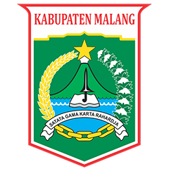

<p align="center">
    
</p>

<h1 align="center">Karanganyar Village Official Website</h1>

<p align="center">
    <strong>Digital Platform for Karanganyar Village, Poncokusumo District, Malang Regency</strong>
</p>

<p align="center">
    <a href="#features">Features</a> •
    <a href="#technology-stack">Tech Stack</a> •
    <a href="#installation">Installation</a> •
    <a href="#usage">Usage</a> •
    <a href="#contributing">Contributing</a> •
    <a href="#license">License</a>
</p>

---
## 🌐 Live Demo

Visit the live website: [https://karanganyarmalang.com](https://karanganyarmalang.com)


## 🏘️ About

The **Karanganyar Village Official Website** is a comprehensive digital platform designed to serve the community of Karanganyar Village, located in Poncokusumo District, Malang Regency, East Java, Indonesia. This modern web application facilitates seamless interaction between village administration and residents while promoting local potential and transparency in governance.

### 🎯 Mission
To create a digital bridge that enhances public services, promotes local economic potential, and fosters community engagement through accessible and user-friendly technology.

## ✨ Features

### 🏛️ **Village Administration**
- **Document Services**: Online letter requests and status tracking
- **Announcements**: Official village announcements and notifications
- **News Portal**: Latest village news and updates
- **Administrative Dashboard**: Comprehensive admin panel for content management

### 📊 **Village Statistics**
- **Population Demographics**: Real-time population statistics
- **Geographic Information**: Village area and territorial data
- **Interactive Maps**: Visual representation of village boundaries

### 🏪 **Economic Development**
- **UMKM Showcase**: Local small and medium enterprises directory
- **Agricultural Products**: Highlighting local agricultural potential
- **BUMDes Information**: Village-owned enterprise statistics and reports

### 👥 **Community Services**
- **Village Profile**: Complete information about village vision, mission, and officials
- **Public Services**: Easy access to various village services
- **User Authentication**: Secure login system for residents

### 🔍 **SEO & Performance**
- **Search Engine Optimized**: Comprehensive SEO implementation
- **Mobile Responsive**: Fully responsive design for all devices
- **Fast Loading**: Optimized performance with modern web technologies

## 🛠️ Technology Stack

### **Backend**
- **Framework**: Laravel 11.x
- **Database**: MySQL
- **Authentication**: Laravel Sanctum
- **API**: RESTful API architecture

### **Frontend**
- **Framework**: React 18.x with Inertia.js
- **Styling**: Tailwind CSS
- **Build Tool**: Vite
- **State Management**: React Hooks
- **Animations**: GSAP, Framer Motion

### **Additional Tools**
- **Analytics**: Google Analytics 4
- **Charts**: Recharts
- **Icons**: Lucide React
- **SEO**: Custom SEO components with JSON-LD structured data

## 🚀 Installation

### Prerequisites
- PHP >= 8.1
- Composer
- Node.js >= 16.x
- MySQL >= 8.0

### Setup Instructions

1. **Clone the repository**
```bash
git clone https://github.com/your-username/karanganyar-village-website.git
cd karanganyar-village-website
```

2. **Install PHP dependencies**
```bash
composer install
```

3. **Install Node.js dependencies**
```bash
npm install
```

4. **Environment configuration**
```bash
cp .env.example .env
php artisan key:generate
```

5. **Configure database**
```env
DB_CONNECTION=mysql
DB_HOST=127.0.0.1
DB_PORT=3306
DB_DATABASE=karanganyar_db
DB_USERNAME=your_username
DB_PASSWORD=your_password
```

6. **Run database migrations**
```bash
php artisan migrate --seed
```

7. **Build frontend assets**
```bash
npm run build
```

8. **Start the development server**
```bash
# Backend
php artisan serve

# Frontend (in another terminal)
npm run dev
```

## 📖 Usage

### **For Residents**
1. **Browse Village Information**: Access village profile, news, and announcements
2. **Request Documents**: Submit online requests for official letters
3. **Track Applications**: Monitor the status of document requests
4. **Explore Local Business**: Discover local UMKM and agricultural products

### **For Administrators**
1. **Content Management**: Create and manage news, announcements, and UMKM listings
2. **Document Processing**: Review and process resident document requests
3. **Statistics Management**: Update village demographic and geographic data
4. **User Management**: Manage resident accounts and permissions

## 📱 Key Pages

- **Homepage** (`/`): Village overview with key statistics and featured content
- **Village Profile** (`/profil`): Complete village information, vision, mission, and officials
- **News Portal** (`/portal`): Latest village news and updates
- **Services** (`/layanan`): Online document services for residents
- **Announcements** (`/pengumuman`): Official village announcements
- **UMKM Directory** (`/sub-umkm/{slug}`): Local business profiles

## 🔧 Configuration

### **SEO Configuration**
The website includes comprehensive SEO features:
- Dynamic meta tags
- Open Graph and Twitter Card support
- JSON-LD structured data
- XML sitemap generation
- Robots.txt optimization

### **Analytics Setup**
Configure Google Analytics in your `.env` file:
```env
VITE_GA_TRACKING_ID=your_ga_tracking_id
```

## 🤝 Contributing

We welcome contributions from the community! Please follow these steps:

1. Fork the repository
2. Create a feature branch (`git checkout -b feature/amazing-feature`)
3. Commit your changes (`git commit -m 'Add some amazing feature'`)
4. Push to the branch (`git push origin feature/amazing-feature`)
5. Open a Pull Request

### **Development Guidelines**
- Follow PSR-12 coding standards for PHP
- Use ESLint and Prettier for JavaScript/React code
- Write meaningful commit messages
- Include tests for new features
- Update documentation as needed

## 📄 License

This project is licensed under the MIT License - see the [LICENSE](LICENSE) file for details.

## 🙏 Acknowledgments

- **Karanganyar Village Government** for their vision and support
- **Laravel Community** for the excellent framework
- **React Community** for the powerful frontend library
- **Open Source Contributors** who made this project possible

## 📞 Contact

**Karanganyar Village Government**
- **Address**: Karanganyar Village, Poncokusumo District, Malang Regency, East Java, Indonesia
- **Website**: [https://karanganyarmalang.com](https://karanganyarmalang.com)
- **Email**: info@karanganyarmalang.com

---

<p align="center">
    <strong>Built with ❤️ for Karanganyar Village Community</strong>
</p>

<p align="center">
    <sub>Empowering rural communities through digital innovation</sub>
</p>

